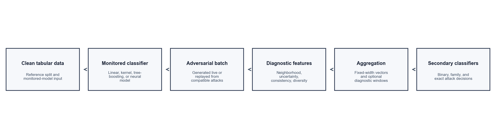
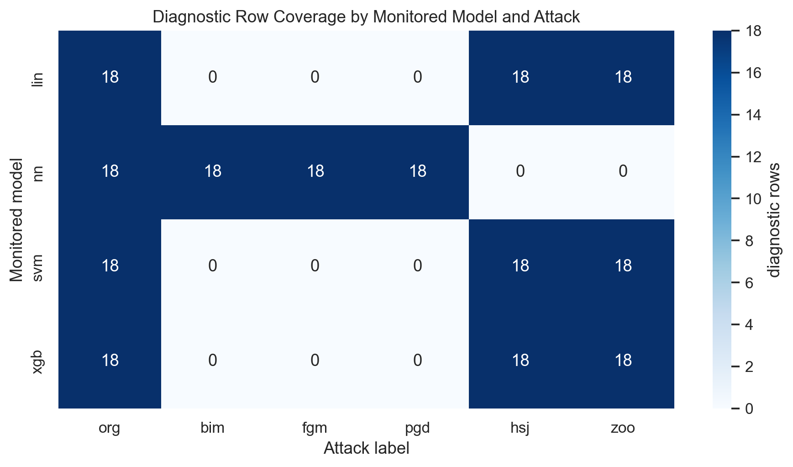
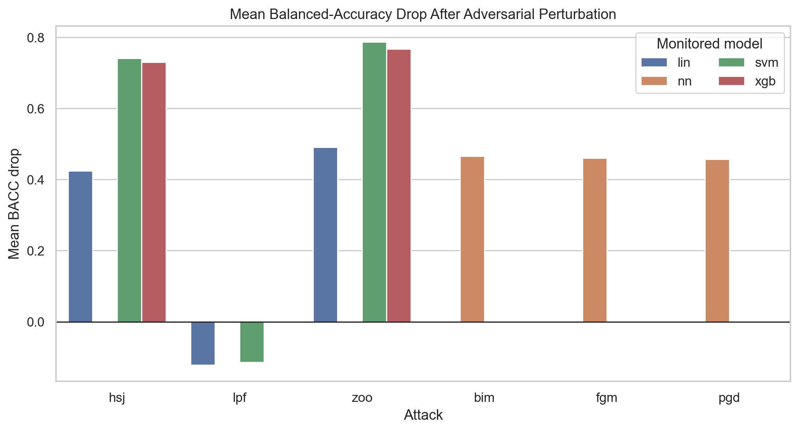
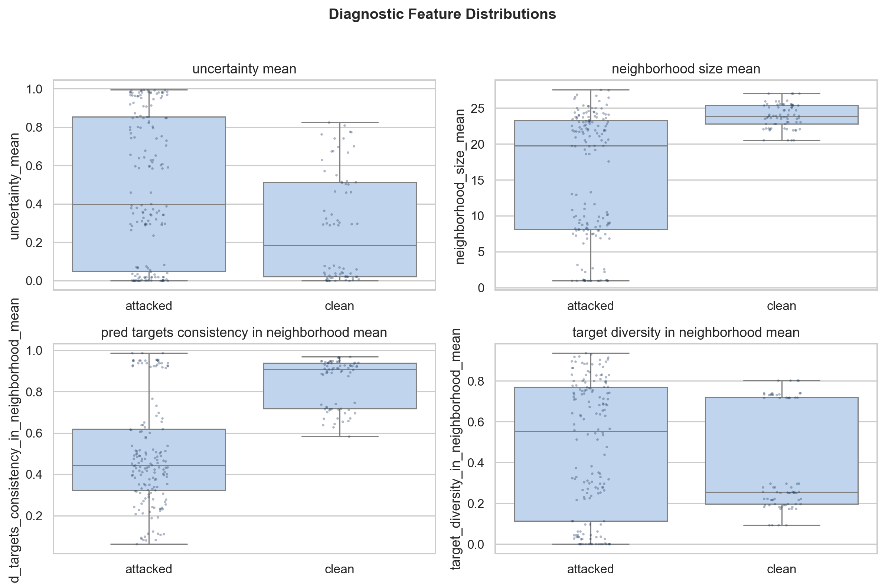
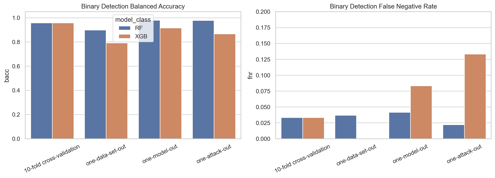
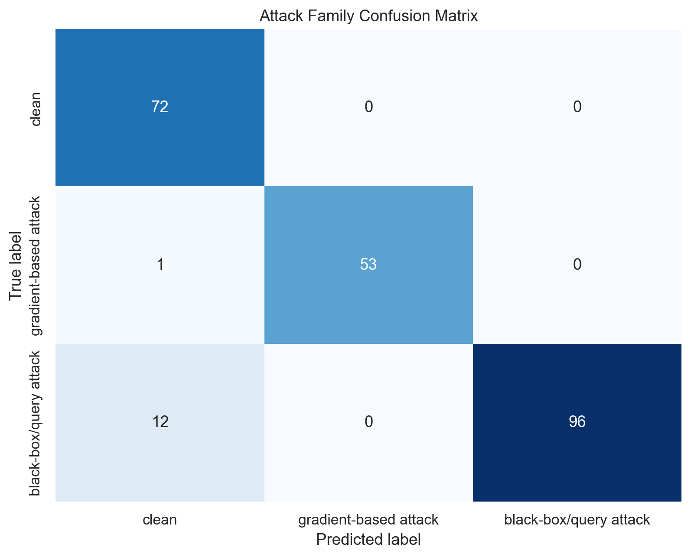
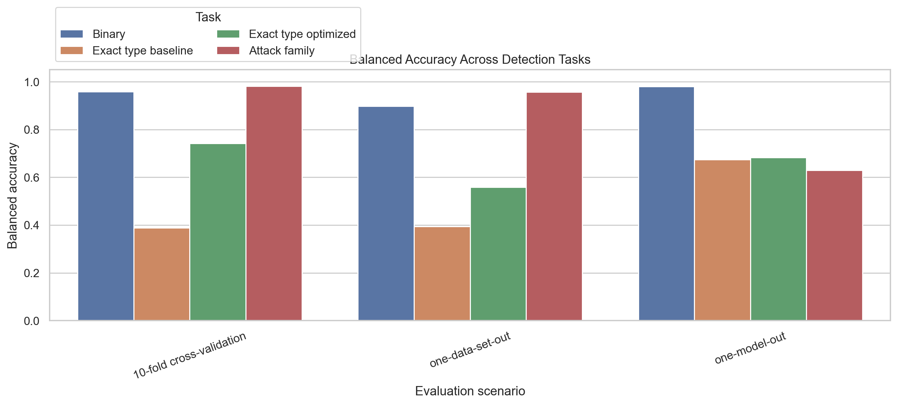
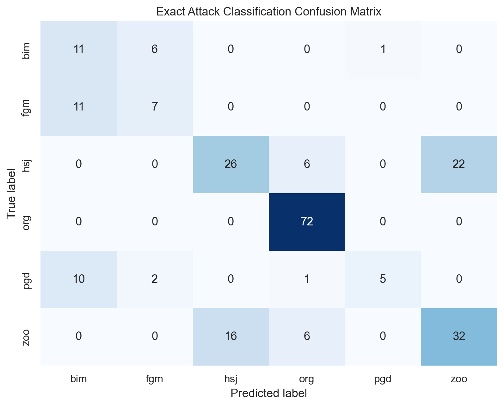
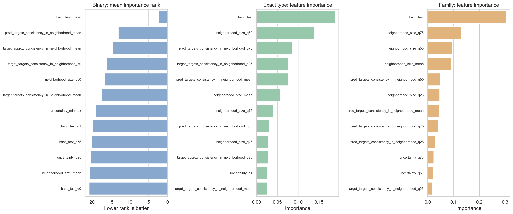

# Adversarial Attack Detection for Tabular Data

## Executive Summary

This report describes a self-contained adversarial attack detection workflow for tabular classification systems. The workflow converts clean and adversarial batches into fixed-width diagnostic vectors, then trains secondary classifiers for three tasks: binary attack identification, attack family classification, and exact attack type classification.

The main observation is consistent across the experiment outputs: binary attack identification is the most stable task, exact attack type classification is substantially harder, and attack family classification provides a useful middle level between the two. This behavior is expected because several attack algorithms can produce overlapping diagnostic footprints even when their optimization procedures differ.



## 1. Data Generation

The data generation process begins with clean tabular datasets and a set of monitored classifiers. Each monitored classifier is trained on clean data and then evaluated on both clean and adversarial batches. Clean batches receive the label `org`; adversarial batches receive the label of the attack procedure that generated or supplied them.

Let a clean instance be $x \in \mathbb{R}^d$ with target label $y$, and let the monitored classifier be $f(\cdot)$. An adversarial instance is represented as:

$$
x' = x + \delta, \quad \|\delta\|_p \leq \epsilon, \quad f(x') \neq y.
$$

The perturbation $\delta$ is generated or replayed according to attack compatibility with the monitored classifier. Gradient-based attacks are used where gradients are practical, while query-based attacks are used when the monitored classifier is not naturally differentiable. This produces adversarial data with different signatures: dense small perturbations for gradient-based attacks and sparse or boundary-seeking perturbations for query-based attacks.

The available diagnostic rows cover the following monitored models and attack labels:



The upstream attack evaluation measures how much each perturbation degrades the monitored classifier. A large positive balanced-accuracy drop means the attack successfully pushed samples into regions where the monitored classifier made more mistakes.



## 2. Feature Engineering

The detector does not operate directly on raw tabular rows. Instead, it summarizes a batch through diagnostic attributes derived from local neighborhood behavior around each diagnosed instance. This makes the detection layer less dependent on the original dataset dimensionality and more focused on how the monitored classifier behaves around clean and perturbed data.

For a diagnosed instance $x$ and a reference set $R$, a local neighborhood can be written as:

$$
N(x) = \{z \in R : s(x, z) \geq \tau\},
$$

where $s(x,z)$ is a similarity rule in the processed feature space and $\tau$ is the neighborhood threshold. The implementation uses a self-contained neighborhood surrogate to create comparable diagnostic attributes across datasets and monitored models.

The uncertainty of a local prediction distribution $q$ over $C$ classes is computed with normalized entropy:

$$
H_{norm}(q) = -\frac{1}{\log C} \sum_{c=1}^C q_c \log(q_c).
$$

Balanced accuracy is used because clean and attacked classes can be imbalanced:

$$
\operatorname{BACC} = \frac{1}{C} \sum_{c=1}^C \frac{TP_c}{TP_c + FN_c}.
$$

For each diagnostic quantity $g$, the batch-level vector stores summary statistics:

$$
\phi_g(B) = [\operatorname{mean}(g), q_0(g), q_{25}(g), q_{50}(g), q_{75}(g), q_1(g), \max(g)-\min(g)].
$$

The final diagnostic vector includes neighborhood size, uncertainty, prediction consistency, target consistency, diversity measures, dataset-level metadata, and the monitored model's clean or adversarial balanced accuracy. The binary target is:

$$
y_{bin} = \mathbb{1}[a \neq \text{org}],
$$

where $a$ is the attack label. The family target is:

$$
y_{family} =
\begin{cases}
\text{clean}, & a = \text{org},\\
\text{gradient-based attack}, & a \in \{\text{bim}, \text{fgm}, \text{pgd}\},\\
\text{black-box/query attack}, & a \in \{\text{hsj}, \text{zoo}\}.
\end{cases}
$$

Exact attack classification keeps the original attack label:

$$
y_{type} \in \{\text{org}, \text{bim}, \text{fgm}, \text{pgd}, \text{hsj}, \text{zoo}\}.
$$

The diagnostic distributions show why a secondary classifier can detect attacks: clean and attacked batches tend to separate through uncertainty, neighborhood size, consistency, and diversity.



### Engineered Features Used by the Models

The binary detector uses the full aggregated diagnostic vector. The optimized exact attack and attack family classifiers use selected diagnostic features after variance filtering, correlation handling, and top-k selection.

**Binary attack identifier feature set (66 features)**

```text
n_test
n_classes
neighborhood_size_mean
neighborhood_size_q0
neighborhood_size_q25
neighborhood_size_q50
neighborhood_size_q75
neighborhood_size_q1
neighborhood_size_minmax
uncertainty_mean
uncertainty_q0
uncertainty_q25
uncertainty_q50
uncertainty_q75
uncertainty_q1
uncertainty_minmax
target_approx_consistency_in_neighborhood_mean
target_approx_consistency_in_neighborhood_q0
target_approx_consistency_in_neighborhood_q25
target_approx_consistency_in_neighborhood_q50
target_approx_consistency_in_neighborhood_q75
target_approx_consistency_in_neighborhood_q1
target_approx_consistency_in_neighborhood_minmax
pred_targets_consistency_in_neighborhood_mean
pred_targets_consistency_in_neighborhood_q0
pred_targets_consistency_in_neighborhood_q25
pred_targets_consistency_in_neighborhood_q50
pred_targets_consistency_in_neighborhood_q75
pred_targets_consistency_in_neighborhood_q1
pred_targets_consistency_in_neighborhood_minmax
target_targets_consistency_in_neighborhood_mean
target_targets_consistency_in_neighborhood_q0
target_targets_consistency_in_neighborhood_q25
target_targets_consistency_in_neighborhood_q50
target_targets_consistency_in_neighborhood_q75
target_targets_consistency_in_neighborhood_q1
target_targets_consistency_in_neighborhood_minmax
targets_and_approxs_consistency_in_neighborhood_mean
targets_and_approxs_consistency_in_neighborhood_q0
targets_and_approxs_consistency_in_neighborhood_q25
targets_and_approxs_consistency_in_neighborhood_q50
targets_and_approxs_consistency_in_neighborhood_q75
targets_and_approxs_consistency_in_neighborhood_q1
targets_and_approxs_consistency_in_neighborhood_minmax
target_diversity_in_neighborhood_mean
target_diversity_in_neighborhood_q0
target_diversity_in_neighborhood_q25
target_diversity_in_neighborhood_q50
target_diversity_in_neighborhood_q75
target_diversity_in_neighborhood_q1
target_diversity_in_neighborhood_minmax
approx_diversity_in_neighborhood_mean
approx_diversity_in_neighborhood_q0
approx_diversity_in_neighborhood_q25
approx_diversity_in_neighborhood_q50
approx_diversity_in_neighborhood_q75
approx_diversity_in_neighborhood_q1
approx_diversity_in_neighborhood_minmax
bacc_test_mean
bacc_test_q0
bacc_test_q25
bacc_test_q50
bacc_test_q75
bacc_test_q1
bacc_test_minmax
```

**Optimized exact attack classifier feature set (35 features)**

```text
bacc_test
neighborhood_size_mean
uncertainty_q50
uncertainty_q75
uncertainty_q25
pred_targets_consistency_in_neighborhood_q50
target_targets_consistency_in_neighborhood_q25
uncertainty_mean
pred_targets_consistency_in_neighborhood_mean
target_diversity_in_neighborhood_mean
neighborhood_size_q25
target_targets_consistency_in_neighborhood_mean
pred_targets_consistency_in_neighborhood_q25
neighborhood_size_q50
target_approx_consistency_in_neighborhood_q25
uncertainty_q0
target_diversity_in_neighborhood_q75
approx_diversity_in_neighborhood_mean
pred_targets_consistency_in_neighborhood_q75
neighborhood_size_q75
target_targets_consistency_in_neighborhood_q0
target_targets_consistency_in_neighborhood_q50
uncertainty_q1
target_approx_consistency_in_neighborhood_mean
target_targets_consistency_in_neighborhood_minmax
uncertainty_minmax
target_approx_consistency_in_neighborhood_q75
target_approx_consistency_in_neighborhood_q50
approx_diversity_in_neighborhood_q75
target_targets_consistency_in_neighborhood_q75
approx_diversity_in_neighborhood_q50
target_diversity_in_neighborhood_q50
target_diversity_in_neighborhood_q25
pred_targets_consistency_in_neighborhood_minmax
targets_and_approxs_consistency_in_neighborhood_q25
```

**Optimized attack family classifier feature set (35 features)**

```text
bacc_test
neighborhood_size_mean
pred_targets_consistency_in_neighborhood_q50
target_targets_consistency_in_neighborhood_q25
uncertainty_q75
target_diversity_in_neighborhood_mean
target_targets_consistency_in_neighborhood_mean
uncertainty_q50
uncertainty_q25
neighborhood_size_q25
pred_targets_consistency_in_neighborhood_q25
pred_targets_consistency_in_neighborhood_mean
target_diversity_in_neighborhood_q75
pred_targets_consistency_in_neighborhood_q75
target_approx_consistency_in_neighborhood_q25
neighborhood_size_q50
uncertainty_mean
target_targets_consistency_in_neighborhood_q0
uncertainty_q1
approx_diversity_in_neighborhood_mean
target_targets_consistency_in_neighborhood_q50
neighborhood_size_q75
target_targets_consistency_in_neighborhood_minmax
target_approx_consistency_in_neighborhood_mean
uncertainty_q0
target_approx_consistency_in_neighborhood_q75
target_targets_consistency_in_neighborhood_q75
target_approx_consistency_in_neighborhood_q50
approx_diversity_in_neighborhood_q75
target_diversity_in_neighborhood_q50
approx_diversity_in_neighborhood_q50
target_diversity_in_neighborhood_minmax
approx_diversity_in_neighborhood_q25
target_diversity_in_neighborhood_q25
target_approx_consistency_in_neighborhood_minmax
```

## 3. Binary Attack Identification

The binary task predicts whether a diagnostic vector came from clean data or adversarially perturbed data. Random Forest and XGBoost classifiers were trained with balanced-accuracy-oriented evaluation. The evaluation uses repeated generalization scenarios: cross-validation, held-out dataset, held-out monitored model, and held-out attack.

**Binary Random Forest best parameters:**

```json
{
  "max_depth": 50,
  "min_samples_split": 2,
  "n_estimators": 200
}
```

**Binary XGBoost best parameters:**

```json
{
  "max_depth": 6,
  "learning_rate": 0.3,
  "n_estimators": 100
}
```

Binary detection is the strongest of the three tasks. It avoids the hardest distinction, which is separating similar attack algorithms from one another, and instead only asks whether the batch behavior is normal or suspicious.



**Binary metric summary**

| scenario | bacc | kappa | precision | recall | f1 | fnr |
| --- | --- | --- | --- | --- | --- | --- |
| 10-fold cross-validation | 0.9583 | 0.9000 | 0.9667 | 0.9667 | 0.9600 | 0.0333 |
| one-attack-out | 0.9222 | 0 | 1 | 0.9222 | 0.9441 | 0.0778 |
| one-data-set-out | 0.8449 | 0.7030 | 0.9017 | 0.9815 | 0.9345 | 0.0185 |
| one-model-out | 0.9479 | 0.8746 | 0.9821 | 0.9375 | 0.9540 | 0.0625 |

## 4. Attack Family Classification

Attack family classification groups exact attack labels into broader categories. This task predicts whether a diagnostic vector is clean, gradient-based adversarial data, or black-box/query-based adversarial data.

The selected family classifier is `extratrees` with the following parameters:

```json
{
  "n_estimators": 850,
  "max_depth": 12,
  "min_samples_split": 6,
  "min_samples_leaf": 4,
  "max_features": null
}
```

The family classifier uses diagnostic windows and class-aware training so that the model receives more than one aggregate row for each dataset/model/attack combination. This increases the number of training examples while preserving the batch-level diagnostic interpretation.

**Attack family metric summary**

| scenario | bacc | kappa | precision_weighted | recall_weighted | f1_weighted |
| --- | --- | --- | --- | --- | --- |
| 10-fold cross-validation | 0.9815 | 0.9601 | 0.9763 | 0.9744 | 0.9745 |
| one-data-set-out | 0.9568 | 0.9141 | 0.9529 | 0.9444 | 0.9452 |
| one-model-out | 0.6296 | 0.5517 | 0.6221 | 0.7179 | 0.6454 |



## 5. Exact Attack Type Classification

Exact attack type classification predicts the specific attack label. This task is more difficult than binary detection or family classification because multiple attacks can produce overlapping behavior in the diagnostic feature space. For example, iterative gradient attacks can resemble each other, and query-based attacks can create similar boundary-seeking signatures.

The baseline exact classifier used Random Forest and XGBoost models. The optimized exact classifier used diagnostic windows, constrained prediction labels, guarded resampling, feature filtering, and hyperparameter search.

**Baseline exact Random Forest best parameters:**

```json
{
  "max_depth": 50,
  "min_samples_split": 2,
  "n_estimators": 200
}
```

**Baseline exact XGBoost best parameters:**

```json
{
  "max_depth": 6,
  "learning_rate": 0.1,
  "n_estimators": 500
}
```

The selected optimized exact classifier is `extratrees` with the following parameters:

```json
{
  "n_estimators": 850,
  "max_depth": 12,
  "min_samples_split": 6,
  "min_samples_leaf": 4,
  "max_features": null
}
```

**Baseline exact attack metric summary**

| scenario | bacc | kappa | precision_weighted | recall_weighted | f1_weighted |
| --- | --- | --- | --- | --- | --- |
| 10-fold cross-validation | 0.3588 | 0.4421 | 0.5667 | 0.5641 | 0.5377 |
| one-data-set-out | 0.3819 | 0.3522 | 0.4101 | 0.5000 | 0.4114 |
| one-model-out | 0.6181 | 0.5160 | 0.6361 | 0.6181 | 0.6078 |

**Optimized exact attack metric summary**

| scenario | bacc | kappa | precision_weighted | recall_weighted | f1_weighted |
| --- | --- | --- | --- | --- | --- |
| 10-fold cross-validation | 0.7411 | 0.7618 | 0.8129 | 0.8156 | 0.8062 |
| one-data-set-out | 0.5586 | 0.5540 | 0.6690 | 0.6538 | 0.6096 |
| one-model-out | 0.6829 | 0.5556 | 0.6424 | 0.6829 | 0.6388 |





## 6. Feature Importance

Across the three tasks, the most influential features are usually the monitored model balanced accuracy, neighborhood size summaries, prediction consistency, target consistency, and uncertainty. This indicates that the detector is primarily using changes in local classifier behavior rather than memorizing raw feature values.



## 7. Conclusions

The implemented workflow converts heterogeneous tabular datasets into a shared diagnostic representation and uses secondary classifiers to identify adversarial manipulation. Binary attack identification is the most reliable target because it only requires separating clean and suspicious behavior. Exact attack classification remains harder because several attack algorithms can leave similar diagnostic traces. Attack family classification reduces that ambiguity by grouping attacks according to their broader perturbation mechanism.

The strongest practical direction for further improvement is to generate more diagnostic windows from additional datasets, monitored models, and attack settings. This would reduce the small-sample effect in multiclass classification and make the exact attack classifier less dependent on a few dataset/model combinations.
